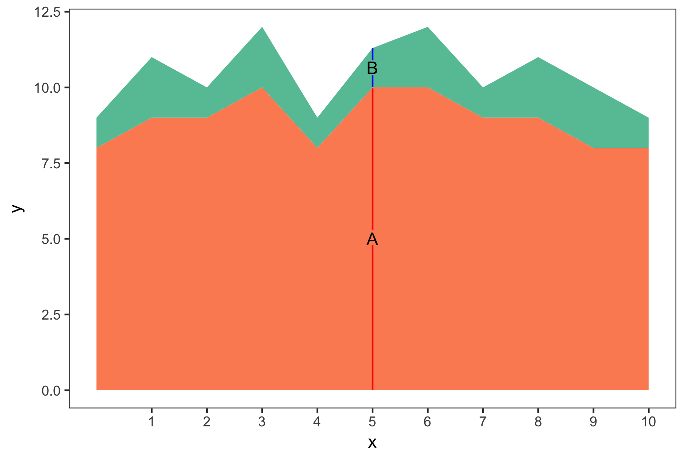

# Stacked Area Graphical Perception Experiment

This repo contains an experiment to test viewers' perception of stacked area
charts. Currently written as a Flask app, the experiment shows information about
the study (including contact information), then takes viewers to a page where
they are presented with a chart and are asked to answer a few questions about
it.

[`chart_generator.R`](chart_generator.R) is the file that creates the chart
images.

The [`experiment_app/`](experiment_app/) folder has the code for the experiment
itself. This is very much still a work in progress.

Currently the app is running at https://salty-shore-16410.herokuapp.com.
However, to progress beyond the first page you need a URL like
https://salty-shore-16410.herokuapp.com/?assignmentId=67483929810ASLDKFJ929&workerId=295JS19XQ&hitId=123RVWYBAZW00EXAMPLE.
These parameters get sent on to the next page so that they can be returned along
with the workers' results.

## TODO

A bunch of things still:

- Right now there is only one task with a hard-coded image. One of the next
  steps is figuring out how to create a batch of tasks with all of the images.
- Include a training task that will show people a chart where one segment is
  drastically smaller than the other, and the places to be compared are labeled:
  
  

- If people get the training task wrong, there should be some kind of
  explanation that pops up.
- Create a little database (or something) to store the IDs of workers who have
  completed tasks in the past so that they can bypass the training task.
  Potentially they could bypass the info page as well, though we'd want to make
  sure to include my contact info on the main task page so they could get in
  touch if they had questions midway through the batch.
  
  

